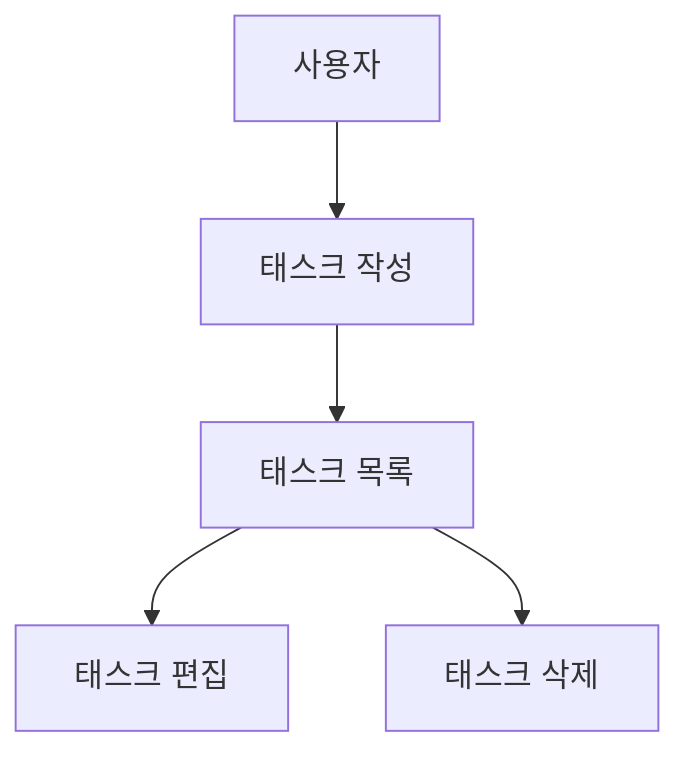

# CLAUDE.md (프로젝트 메모리)

## 개요
개발 진행에서 준수해야 할 표준 규칙을 정의합니다.

## 프로젝트 구조

본 리포지토리는 태스크 관리 애플리케이션 전용 리포지토리입니다.

### 문서 분류

#### 1. 영구 문서 (`docs/`)

애플리케이션 전체의 "**무엇을 만들 것인가**", "**어떻게 만들 것인가**"를 정의하는 영구적인 문서입니다.
애플리케이션의 기본 설계나 방침이 바뀌지 않는 한 업데이트되지 않습니다.

- **product-requirements.md** - 제품 요구사항 명세서
  - 제품 비전과 목적
  - 대상 사용자, 과제 및 요구사항(니즈)
  - 주요 기능 목록
  - 성공 조건 정의
  - 비즈니스 요구사항
  - 유저 스토리
  - 인수 조건
  - 기능 요구사항
  - 비기능 요구사항

- **functional-design.md** - 기능 설계서
  - 기능별 아키텍처
  - 시스템 구성도
  - 데이터 모델 정의 (ER 다이어그램 포함)
  - 컴포넌트 설계
  - 유스케이스 다이어그램, 화면 전이도, 와이어프레임
  - API 설계 (백엔드와 연동할 경우)

- **architecture.md** - 기술 사양서
  - 테크놀로지 스택
  - 개발 도구와 기법
  - 기술적 제약과 요구사항
  - 성능 요구사항

- **repository-structure.md** - 저장소 구조 정의서
  - 폴더와 파일 구성
  - 디렉토리별 역할
  - 파일 배치 규칙

- **development-guidelines.md** - 개발 가이드라인
  - 코딩 규약
  - 명명 규칙
  - 스타일링 규약
  - 테스트 규약
  - Git 규약

- **glossary.md** - 보편 언어 정의
  - 도메인 용어 정의
  - 비즈니스 용어 정의
  - UI/UX 용어 정의
  - 영어/한국어 대응표
  - 코드 내 명명 규칙


#### 2. 작업 단위 문서 (`.steering/[YYYYMMDD]-[개발 타이틀]/`)

특정 개발 작업에서 "**이번에 무엇을 할 것인가**"를 정의하는 임시 스티어링 파일입니다.
작업 완료 후에는 참조용으로 유지되지만, 새로운 작업에서는 새로운 디렉토리를 생성합니다.

- **requirements.md** - 이번 작업의 요구 내용
  - 변경/추가하는 기능 설명
  - 사용자 스토리
  - 인수 조건
  - 제약 사항

- **design.md** - 변경 내용 설계
  - 구현 접근 방식
  - 변경할 컴포넌트
  - 데이터 구조 변경
  - 영향 범위 분석

- **tasklist.md** - 작업 목록
  - 구체적인 구현 작업
  - 작업 진행 상황
  - 완료 조건

### 스티어링 디렉토리 명명 규칙

```
.steering/[YYYYMMDD]-[개발 타이틀]/
```

**예:**
- `.steering/20250103-initial-implementation/`
- `.steering/20250115-add-tag-feature/`
- `.steering/20250120-fix-filter-bug/`
- `.steering/20250201-improve-performance/`

## 개발 프로세스

### 초기 셋업 순서

#### 1. 폴더 생성
```bash
mkdir -p docs
mkdir -p .steering
```

#### 2. 영구 문서 생성 (`docs/`)

애플리케이션 전체의 설계를 정의합니다.
각 문서 생성 후 반드시 확인을 받고 다음 단계로 진행합니다.

1. `docs/product-requirements.md` - 제품 요구사항 명세서
2. `docs/functional-design.md` - 기능 설계서
3. `docs/architecture.md` - 기술 사양서
4. `docs/repository-structure.md` - 저장소 구조 정의서
5. `docs/development-guidelines.md` - 개발 가이드라인
6. `docs/glossary.md` - 보편 언어(Ubiquitous Language) 정의

**중요:** 파일 하나를 생성한 후 반드시 확인을 받고 다음 파일 생성을 진행한다.

#### 3. 초기 구현용 스티어링 파일 생성

초기 구현용 디렉토리를 생성하고 구현에 필요한 문서를 배치합니다.

```bash
mkdir -p .steering/[YYYYMMDD]-initial-implementation
```

생성할 문서:
1. `.steering/[YYYYMMDD]-initial-implementation/requirements.md` - 초기 구현 요구사항
2. `.steering/[YYYYMMDD]-initial-implementation/design.md` - 구현 설계
3. `.steering/[YYYYMMDD]-initial-implementation/tasklist.md` - 구현 태스크

#### 4. 환경 설정

#### 5. 구현 개시

`.steering/[YYYYMMDD]-initial-implementation/tasklist.md` 에 기초하여 구현을 진행합니다.

#### 6. 품질 확인

### 기능 추가/수정 순서

#### 1. 영향 분석

- 영구 문서 (`docs/`)에 대한 영향을 확인
- 변경이 기본 설계에 영향을 미치는 경우는 `docs/` 를 업데이트

#### 2. 스티어링 디렉토리 생성

새로운 작업용 디렉토리를 생성합니다.

```bash
mkdir -p .steering/[YYYYMMDD]-[개발 타이틀]
```

**예:**
```bash
mkdir -p .steering/20250115-add-tag-feature
```

#### 3. 작업 문서 생성

작업 단위별 문서를 생성합니다.
각 문서 생성 후, 반드시 확인을 받고 나서 다음으로 진행합니다.

1. `.steering/[YYYYMMDD]-[개발 타이틀]/requirements.md` - 요구사항
2. `.steering/[YYYYMMDD]-[개발 타이틀]/design.md` - 설계
3. `.steering/[YYYYMMDD]-[개발 타이틀]/tasklist.md` - 태스크 리스트

**중요:** 파일 하나를 생성한 후 반드시 확인을 받고 다음 파일 생성을 진행한다.

#### 4. 영구 문서 업데이트 (필요한 경우에만)

변경이 기본 설계에 영향을 미치는 경우, 해당하는 `docs/` 내의 문서를 업데이트합니다.

#### 5. 구현 개시

`.steering/[YYYYMMDD]-[개발 타이틀]/tasklist.md` 에 기초하여 구현을 진행합니다.

#### 6. 품질 확인

## 문서 관리 원칙

### 영구 문서 (`docs/`)
- 애플리케이션의 기본 설계를 기술
- 빈번하게 업데이트되지 않음
- 큰 설계 변경 시에만 업데이트
- 프로젝트 전체의 기준 문서로 기능

### 작업 단위 문서 (`.steering/`)
- 특정 작업/변경에 특화
- 작업마다 새로운 디렉토리를 생성
- 작업 완료 후에는 이력으로서 유지
- 변경 의도와 배경을 기록

## 도표와 다이어그램 작성 규칙

### 작성 위치
설계도나 다이어그램은 관련된 영구 문서 내에 직접 작성합니다.
독립된 diagrams 폴더는 생성하지 않고 필요한 최소한의 내용만 기록합니다.

**배치 예:**
- ER 다이어그램, 데이터 모델도 → `functional-design.md` 내에 기재
- 유스케이스 다이어그램 → `functional-design.md` 또는 `product-requirements.md` 내에 기재
- 화면 전이도, 와이어프레임 → `functional-design.md` 내에 기재
- 시스템 구성도 → `functional-design.md` 또는 `architecture.md` 내에 기재

### 작성 형식
1. **Mermaid 기법 (권장)**
   - Markdown에 직접 내장 가능
   - 버전 관리가 용이
   - 외부 도구 없이 편집 가능



2. **ASCII 아트**
   - 단순한 도표에 사용
   - 텍스트 에디터로 편집 가능

```
┌─────────────┐
│   Header    │
└─────────────┘
       │
       ↓
┌─────────────┐
│  Task List  │
└─────────────┘
```

3. **이미지 파일 (필요한 경우에만)**
   - 복잡한 와이어프레임이나 목업
   - `docs/images/` 폴더에 배치
   - PNG 또는 SVG 형식을 권장

### 도표 업데이트
- 설계 변경 시는 대응하는 도표도 동시에 업데이트
- 도표와 코드 간 불일치를 방지

## 주의 사항

- 문서의 생성과 업데이트는 단계적으로 진행하고, 각 단계마다 확인을 받습니다.
- `.steering/` 의 디렉토리명은 날짜와 개발 타이틀로 명확하게 식별할 수 있도록 합니다.
- 영구 문서와 작업 단위의 문서를 혼동하지 않습니다.
- 코드 변경 후에는 반드시 린트, 타입 체크를 실행합니다.
- 공통 디자인 시스템 (Tailwind CSS)을 사용하여 일관성을 유지합니다.
- 보안을 고려한 코딩 (XSS 대책, 입력값 밸리데이션 등)
- 도표는 유지 보수하기 쉽도록 필요한 최소한의 내용만 기록합니다.
